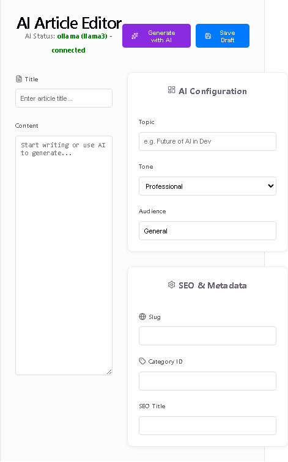

# 🚀 AI-Powered High-Performance Blog

A professional blogging platform that leverages local LLMs (via Ollama) to generate, edit, store, and automatically publish high-quality SEO-optimized articles. With a particularly strong focus on Privacy and Cost-efficiency. Also with a simple implementation flow and application management features that are modular and service oriented.

## 🌟 Key Features

- **AI-Driven Generation**: Generate full articles with structured JSON output including SEO titles, descriptions, and keywords.
- **Local LLM First**: Integrated with **Ollama** for privacy and cost-efficiency, with a provider-agnostic architecture.
- **High Performance**: 
  - MySQL connection pooling for low-latency DB access.
  - Strategic indexing on slugs, status, and scheduling timestamps.
  - Asynchronous background processing for AI and scheduling.
- **Real-time UX**: Socket.IO integration for live AI generation status and publication alerts.
- **Automated Workflow**: Server-side scheduler for automatic publication and autonomous AI article generation.
- **SEO Optimized**: Built-in fields for SEO metadata and slug management.

## 🧠 How the AI Works

The platform implements a sophisticated **Provider Abstraction Layer** to decouple the application logic from the LLM provider.

### The Workflow:
1. **Request**: The user provides a topic, tone, and target audience via the React frontend.
2. **Prompt Engineering**: The `AIService` constructs a strict system prompt requiring the LLM to return **only** a structured JSON object.
3. **Local Execution**: The request is sent to **Ollama** (running locally) using the `llama3` model. 
4. **Optimization**: To prevent truncated articles, we explicitly configure `num_predict: 4096` (max tokens) and `num_ctx: 8192` (context window).
5. **Validation**: The backend parses the JSON response and validates all required fields (title, content, SEO tags) before saving to the database.
6. **Real-time Feedback**: Throughout the process, the server emits Socket.IO events (`ai:generation:started`, `ai:generation:completed`) so the user sees live progress.

## 🖼️ Gallery
*(Screenshots will be added here as the project grows)*
- `frontend-editor.png` - The AI-powered article editor.

- `admin-dashboard.png` - Real-time AI status and article management.
- `public-blog.png` - The high-performance public reading experience.

## 🛠️ Tech Stack

- **Backend**: Node.js, Express
- **Frontend**: React, Vite, Lucide-React
- **Database**: MySQL 8.0+
- **AI**: Ollama (Primary), Provider Abstraction Layer
- **Real-time**: Socket.IO
- **API**: RESTful

## 🚀 Quick Start

### Prerequisites
- Node.js (v18+)
- MySQL
- [Ollama](https://ollama.ai/) installed and running

### Setup
1. **Clone the repo**:
   ```bash
   git clone https://github.com/Jhonattan-Rapprecht/AI-blog.git
   cd AI-blog
   ```

2. **Install Dependencies**:
   ```bash
   npm install
   cd frontend && npm install && cd ..
   ```

3. **Configure Environment**:
   ```bash
   cp .env.example .env
   # Edit .env with your MySQL credentials and Ollama model
   ```

4. **Initialize Database**:
   Run the SQL script in `src/models/schema.sql` on your MySQL instance.

5. **Pull the LLM**:
   ```bash
   ollama pull llama3
   ```

6. **Run the App**:
   ```bash
   # Start Backend
   npm start 
   
   # Start Frontend (in another terminal)
   cd frontend && npm run dev
   ```

## 📐 Architecture

The system follows a modular service-oriented architecture:
`Browser` $\to$ `API/Sockets` $\to$ `Controllers` $\to$ `Services` $\to$ `Models` $\to$ `MySQL/Ollama`

## 📝 License
MIT
