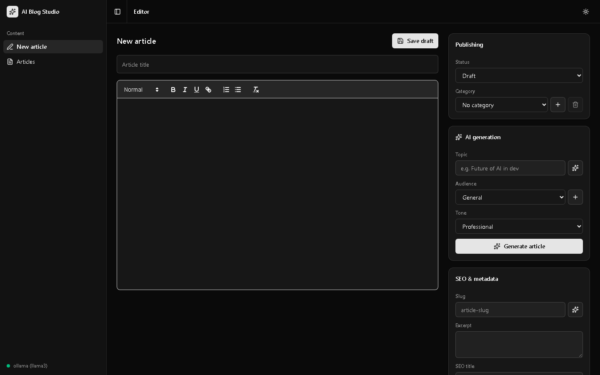
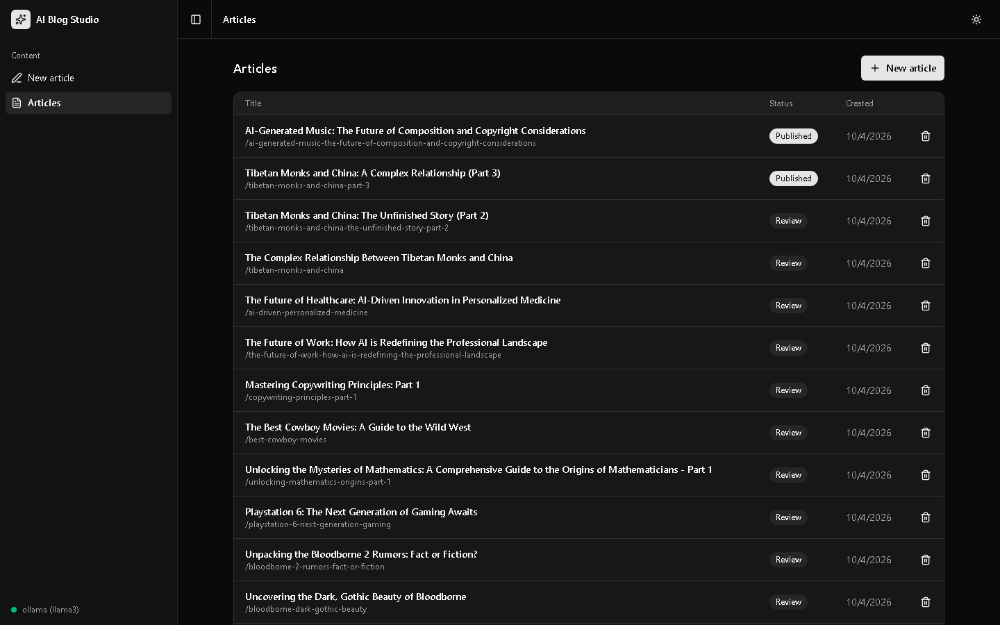
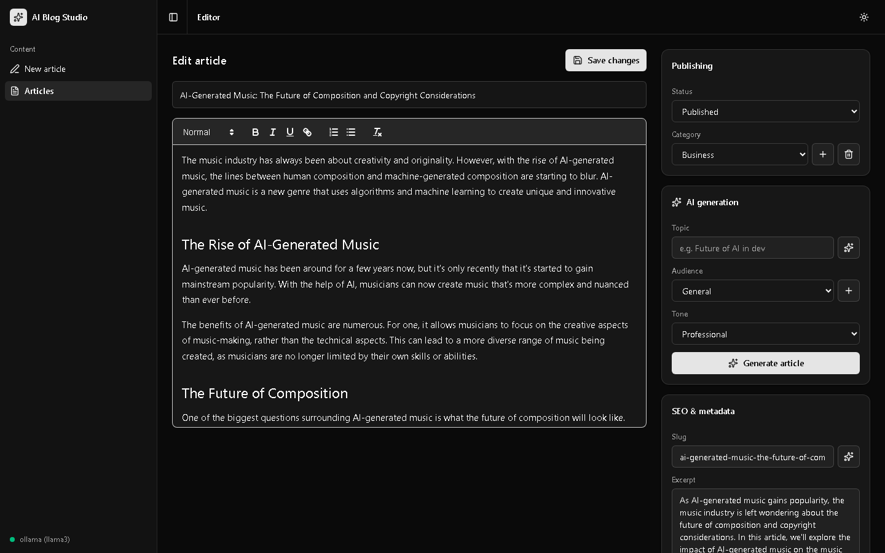
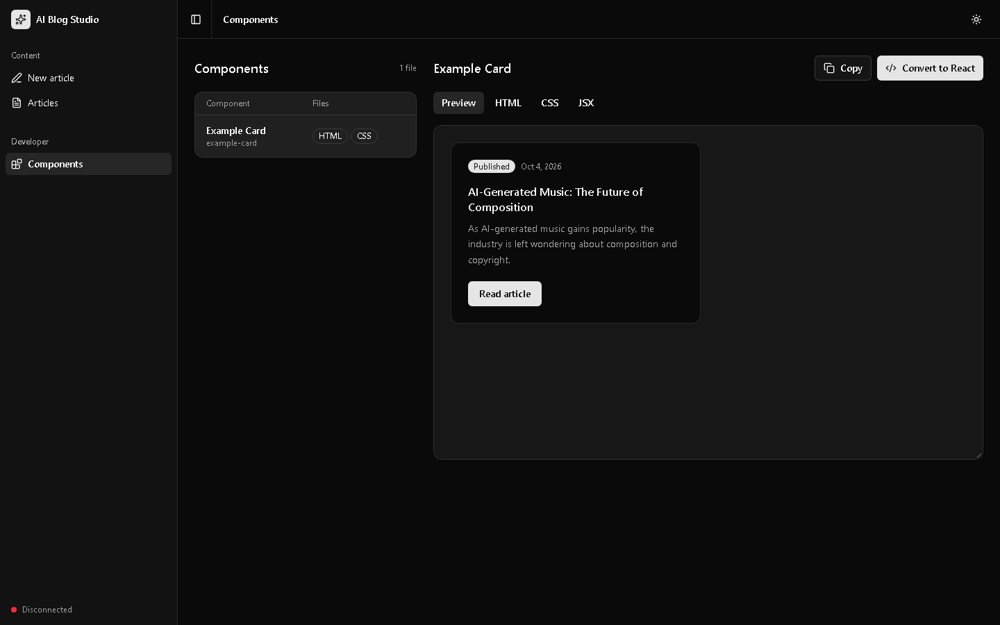
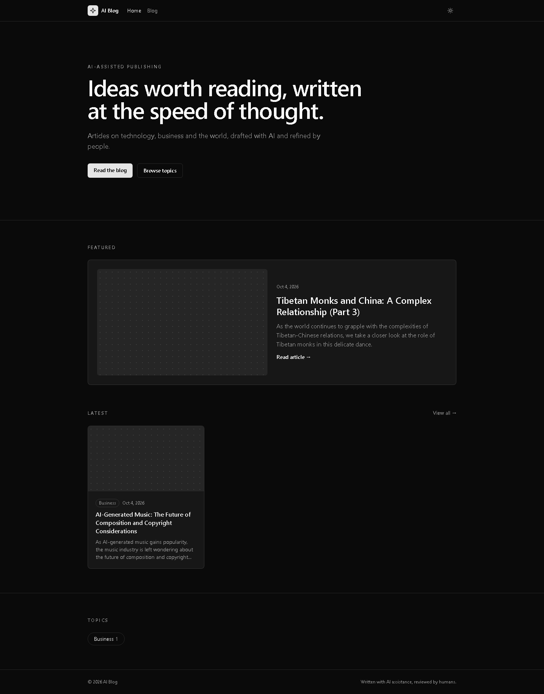
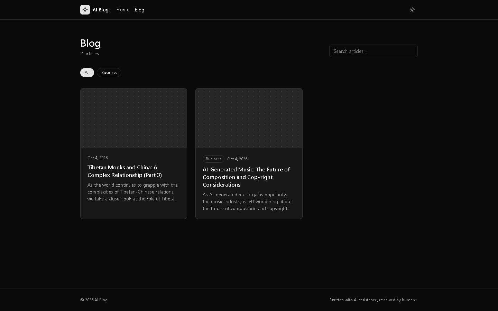
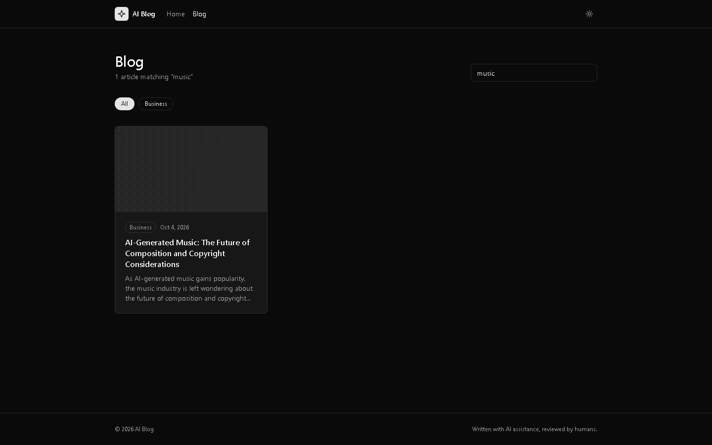
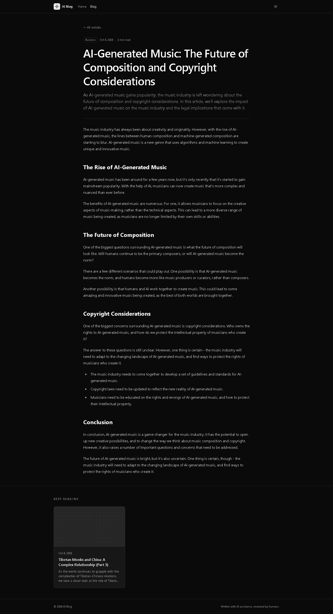
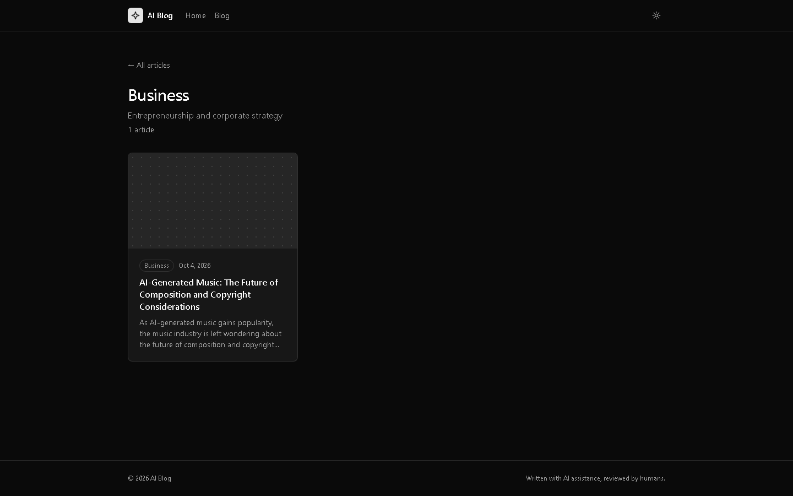
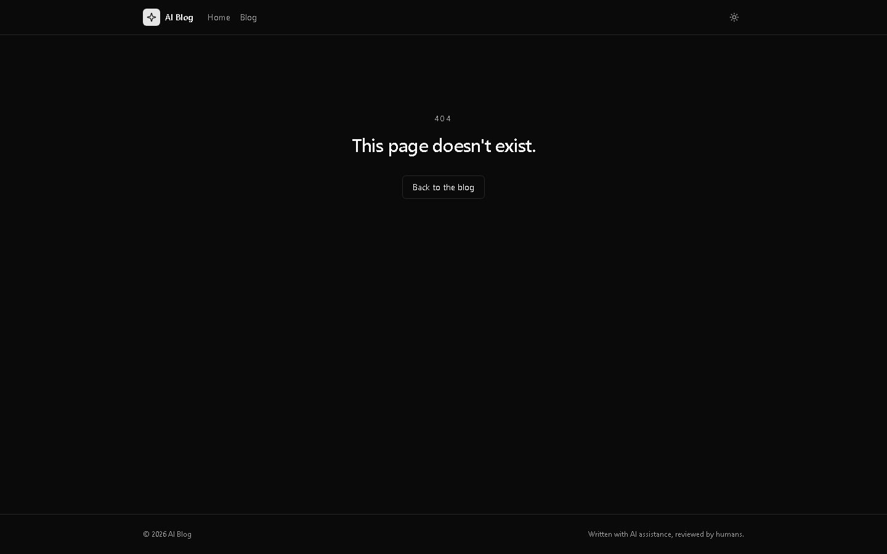

# Pages & Routes Reference

The project runs three apps. `npm run dev` in the project root starts all of them concurrently.

| App | Folder | Stack | Port | Script |
|-----|--------|-------|------|--------|
| API | `src/` | Express + Socket.IO | 3000 | `dev:server` |
| Admin (AI Blog Studio) | `frontend/` | React + Vite + shadcn-ui | 5173 | `dev:client` |
| Public site (AI Blog) | `site/` | Astro (server mode) | 4321 | `dev:site` |

For a user-facing walkthrough with screenshots, see [Pages Guide](../user/pages-guide.md).

---

## Admin (React Router) — `http://localhost:5173`

| Route | Component | Purpose |
|-------|-----------|---------|
| `/` | `pages/EditorPage.jsx` | New article: editor, AI generation, publishing, SEO metadata |
| `/articles` | `pages/ArticlesPage.jsx` | Table of all articles (any status) with open/delete actions |
| `/articles/:id` | `pages/EditorPage.jsx` | Edit an existing article (`PUT` on save instead of `POST`) |
| `/dev/components` | `pages/dev/ComponentsPage.tsx` | **Dev only.** Preview HTML/CSS files from `src/component-previews/`, view source, copy, convert to JSX. Left out of production builds. |

All routes are wrapped in `components/layout/AppShell.jsx` (sidebar, header, theme toggle, AI status).

| Screen | Screenshot |
|--------|------------|
| `/` |  |
| `/articles` |  |
| `/articles/:id` |  |
| `/dev/components` |  |

---

## Public Site (Astro) — `http://localhost:4321`

| Route | File | Purpose |
|-------|------|---------|
| `/` | `src/pages/index.astro` | Hero, featured article, latest articles, topics |
| `/blog` | `src/pages/blog/index.astro` | Article grid with search, category links and pagination |
| `/blog?q=keyword` | | Search title/excerpt |
| `/blog?page=2` | | Pagination |
| `/blog/:slug` | `src/pages/blog/[slug].astro` | Article detail, reading time, related articles |
| `/category/:slug` | `src/pages/category/[slug].astro` | Articles in one category (supports `?page=`) |
| any unknown route | `src/pages/404.astro` | Not found (also used for unknown article/category slugs) |

Category slugs: `business`, `entertainment`, `finance`, `geopolitics`, `health`, `lifestyle`, `technology`.

| Screen | Screenshot |
|--------|------------|
| `/` |  |
| `/blog` |  |
| `/blog?q=music` |  |
| `/blog/:slug` |  |
| `/category/business` |  |
| 404 |  |

---

## API — `http://localhost:3000`

### Admin endpoints

| Method | Endpoint | Purpose |
|--------|----------|---------|
| GET | `/api/articles` | List all articles |
| GET | `/api/articles/:id` | Get one article |
| POST | `/api/articles` | Create article |
| PUT | `/api/articles/:id` | Update article (auto-stamps `published_at` when status becomes `published`) |
| DELETE | `/api/articles/:id` | Delete article |
| GET | `/api/categories` | List categories |
| POST | `/api/categories` | Create category |
| DELETE | `/api/categories/:id` | Delete category |
| POST | `/api/ai/generate-article` | Generate an article with AI |
| POST | `/api/ai/suggest-topic` | Topic suggestions (avoids previously used topics) |
| POST | `/api/ai/suggest-slug` | Slug suggestions |
| GET | `/api/ai/status` | Active AI provider/model |

### Public endpoints (read-only)

Also mounted at `/blog` for backwards compatibility.

| Method | Endpoint | Purpose |
|--------|----------|---------|
| GET | `/api/public/articles` | Published articles; query: `page`, `limit`, `category` (slug), `q` |
| GET | `/api/public/articles/:slug` | One published article with related articles |
| GET | `/api/public/categories` | Categories with published article counts |

An article is publicly visible only when `status = 'published'` and `published_at <= now`.

---

## Regenerating Screenshots

Screenshots live in `docs/user/screenshots/` and are captured at 1440×900 in dark mode with Playwright (the Astro dev toolbar hidden). With all three apps running, capture each URL above with `page.screenshot()`; the home and article pages use `fullPage: true`.
