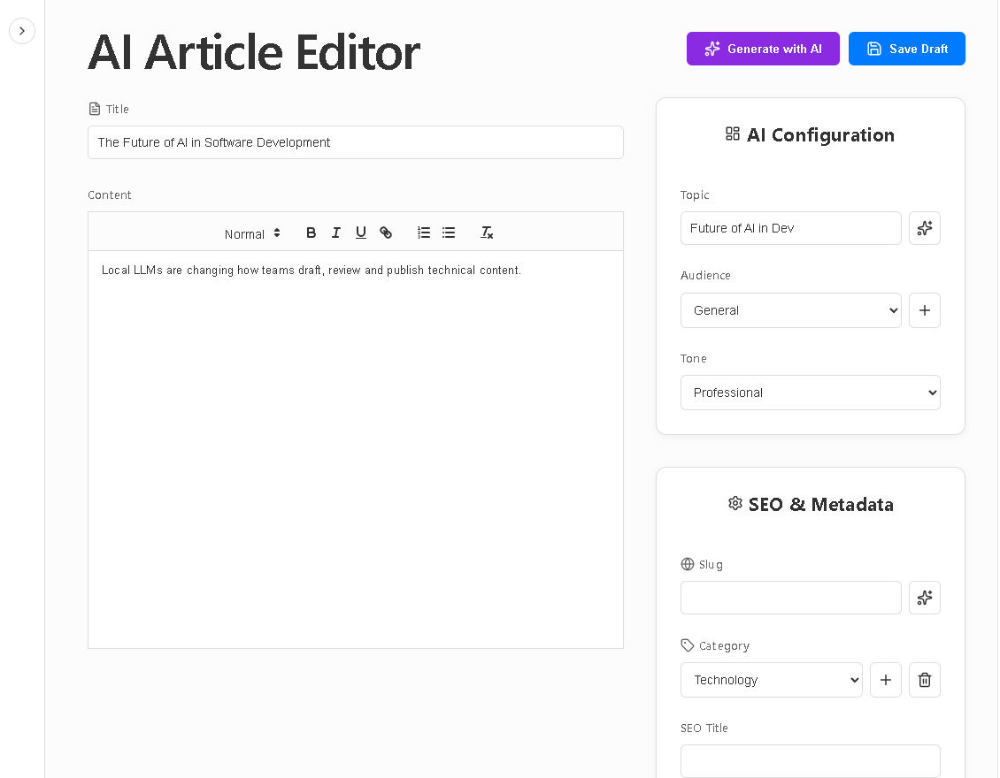
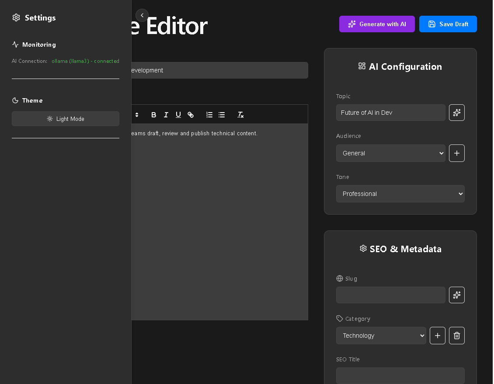

# 🚀 AI Blog - High-Performance Content Engine

A cutting-edge, AI-powered blogging platform designed for professional content creators. This application leverages local LLMs (via Ollama) to automate the heavy lifting of article research, SEO optimization, and drafting, while providing a professional workspace for final human polish.

## ✨ Key Features

### 🤖 AI-Powered Content Suite
- **Full Article Generation**: Generate high-quality, SEO-optimized articles based on a topic, target audience, and tone.
- **AI Topic Ideation**: Get instant, trending topic suggestions to overcome writer's block.
- **Smart Slug Generation**: AI-powered SEO-friendly URL suggestions based on your article title.
- **Structured Output**: Utilizes strict JSON prompting for consistent, parseable AI responses.
- **Real-time Monitoring**: Integrated Socket.IO notifications to track AI generation progress in real-time.

### ✍️ Professional Editor Workspace
- **Rich Text Editing**: Integrated with `react-quill-new` for a seamless, professional writing experience.
- **Dynamic Theme System**: Full support for Light and Dark modes to suit any working environment.
- **Metadata Management**: Effortlessly manage categories, tags, and SEO metadata (Titles, Descriptions, Keywords).
- **Collapsible Control Center**: A streamlined sidebar for AI configuration and workspace settings.

### ⚙️ Technical Architecture
- **LLM Abstraction**: A `ProviderFactory` pattern allowing seamless switching between Ollama (Local) and Online AI providers.
- **High-Performance Backend**: Node.js/Express server with MySQL connection pooling for low-latency data operations.
- **Asynchronous Workflow**: Socket.IO integration for non-blocking AI generation and instant status updates.
- **Responsive Design**: A modern, clean UI built with React and Lucide icons, optimized for productivity.

## 🖼️ Screenshots




## 🛠️ Tech Stack
- **Frontend**: React, Vite, Axios, Socket.io-client, Lucide-React, React-Quill-New.
- **Backend**: Node.js, Express, Socket.io, MySQL2.
- **AI Engine**: Ollama (Llama 3) / Custom AI Providers.
- **Database**: MySQL.

## 🚀 Quick Start

### Prerequisites
- Node.js installed.
- MySQL server running.
- Ollama installed and running with `llama3` pulled (`ollama pull llama3`).

### Installation
1. Clone the repository.
2. Install dependencies:
   ```bash
   npm install
   ```
3. Configure your `.env` file with your MySQL credentials and AI provider settings.
4. Start the backend:
   ```bash
   npm run server
   ```
5. Start the frontend:
   ```bash
   npm run dev
   ```

## 📈 Roadmap
- [ ] Scheduled publishing system.
- [ ] Public-facing reader pages.
- [ ] Multi-model AI comparison.
- [ ] Image generation integration for featured images.
